# Sample app

## Project Overview

This project demonstrates a modern, production-ready backend application using the following technologies:

- **[FastAPI](https://fastapi.tiangolo.com/)**: Modern, fast web framework for building APIs
- **PostgreSQL**: Relational database backend
- **SQLModel**: SQL databases in Python, designed for intuitiveness and compatibility
- **[Twelve-Factor App](https://12factor.net/)** principles for building modern, scalable applications
- **Tracing**: Automatic tracing instrumentation using [OpenTelemetry](https://opentelemetry.io/docs/languages/python/) libraries
- **Prometheus Metrics**: Application metrics exposed on `/metrics` endpoint
- **Docker**: Containerized application and database, supporting multi-platform builds
- **Helm**: Helm charts to package and deploy Kubernetes manifests
- **GitHub Actions**: CI/CD pipelines
- **Comprehensive Testing**: Unit testing with coverage reporting in Pull Requests

## Prerequisites

- [Docker](https://www.docker.com/get-started)
- [Python 3.13+](https://www.python.org/downloads/) (for running tests/linters locally)
- [uv](https://github.com/astral-sh/uv) (for Python dependency management)
- [Helm](https://helm.sh/) (for Kubernetes deployment)

## Project Structure

```sh
app/           # Application code (FastAPI, models, db, tests)
helm/          # Helm chart for Kubernetes deployment
Dockerfile     # Container build
compose.yaml   # Docker Compose for local dev
Makefile       # Common dev/test/build commands
```

## Local Development

1. Clone the repo
2. Run `make dev` to start the app and DB with Docker Compose with hot reload enabled for faster development
3. Access the application:
   - **API Documentation**: [http://localhost:8000/docs](http://localhost:8000/docs) or [http://localhost:8000/redoc](http://localhost:8000/redoc)
   - **Health Check**: [http://localhost:8000/health](http://localhost:8000/health)
   - **Metrics**: [http://localhost:8000/metrics](http://localhost:8000/metrics)

### Running Unit Tests

Run `make test`. Uses `uv`, `coverage` and `pytest` to run the tests and generate a coverage report.

### Common Makefile Commands

- `make dev`           – Start app and db locally with hot reload
- `make test`          – Run tests with coverage
- `make build`         – Build Docker image
- `make helm-install`  – Install Helm chart to local cluster

## Deployment with Helm

The project contains a Helm chart for deploying the application manifests to a Kubernetes cluster. It relies on a generic [`stakater/application`](https://github.com/stakater/application) chart for deploying the application and the [`bitnami/postgresql`](https://github.com/bitnami/charts/tree/main/bitnami/postgresql) chart for deploying the database. Alternatively, an external database like AWS RDS can be used, pointing to it using the `DATABASE_URL` environment variable on the application.

1. Build and push your Docker image to a registry (update `values.yaml` with the image repo/tag)
2. Update Helm dependencies:

   ```sh
   make helm-deps
   ```

3. Install to your cluster:

   ```sh
   make helm-install
   ```

Adjust the `helm/sample-app/values.yaml` accordingly with the different configuration options (ingress, DB, env, etc).

## Observability

### Tracing

The application uses OpenTelemetry for distributed tracing with the FastAPI routes being automatically instrumented.

```sh
# Enable/disable tracing
OTEL_TRACES_EXPORTER=otlp / none
OTEL_EXPORTER_OTLP_TRACES_ENDPOINT=http://localhost:4317
OTEL_SERVICE_NAME=sample-app
```

### **Prometheus Metrics**

The application uses [prometheus-fastapi-instrumentator](https://github.com/trallnag/prometheus-fastapi-instrumentator) for exposing metrics on the `/metrics` endpoint.

```sh
# Enable/disable metrics
ENABLE_METRICS=true / false
```

### **Health Monitoring**

- **Health Endpoint**: `GET /health` for application health checks
- **Readiness Probes**: Kubernetes-ready health check responses
- **Graceful Shutdown**: Proper application lifecycle management

## System Architecture Diagram

This diagram shows the complete system architecture for deploying the application to a public cloud vendor like AWS using modern cloud-native services.

The diagram is written using [Mermaid](https://mermaid.js.org/) which can be [rendered by GitHub](https://docs.github.com/en/get-started/writing-on-github/working-with-advanced-formatting/creating-diagrams) or in [Mermaid Live Editor](https://mermaid.live/).

```mermaid
graph TB
    User[👤 End Users] --> ALB

    subgraph Cloud["Cloud Platform"]
        ALB[Load Balancer<br/>HTTPS & Routing]

        subgraph K8s["Kubernetes Cluster"]
            subgraph Namespace["sample-app Namespace"]
                subgraph App["FastAPI Application"]
                    Pod1[📦 App Pod 1]
                    Pod2[📦 App Pod 2]
                end
                Ingress[Ingress Controller]
                Service[K8s Service]
            end
        end

        subgraph Database["Database"]
            DB[PostgreSQL<br/>Cloud-Managed or In-Cluster]
        end

        subgraph Registry["Container Registry"]
            Image[🐳 App Image]
        end
    end

    ALB --> Ingress
    Ingress --> Service
    Service --> Pod1
    Service --> Pod2
    Pod1 --> DB
    Pod2 --> DB

    K8s -.->|Pull Image| Registry
```



## AWS Architecture Components

The following architecture components can be used for a production-ready deployment of the application on AWS:

### **Compute & Orchestration**

- **Amazon EKS**: Managed Kubernetes cluster for container orchestration
- **Application Pods**: Multiple replicas on separate Availability Zones for high availability
- **Helm Charts**: Package and deploy the necessary K8s manifest
- **Container Registry**: Host the application image (ECR, GitHub Container Registry, etc.)

### **Networking**

- **VPC**: Isolated network with public/private subnets across multiple AZs
- **Route 53**: DNS management with records pointing to the Application Load Balancer
- **Application Load Balancer**: HTTPS termination with SSL certificate and routing to the application pods
- **Ingress Controller**: [Nginx-ingress controller](https://kubernetes.github.io/ingress-nginx/) for Kubernetes service routing

### **Database**

- **Amazon RDS**: Managed database service for PostgreSQL deployment
  - Database credentials can be stored in AWS Secrets Manager and passed to the application using [external-secrets](https://external-secrets.io/)
- **In-Cluster PostgreSQL**: Cheaper alternative for development/testing environments

### **Monitoring & Observability**

- **Logging**: Application stdout logs can be collected by a monitoring agent and centralized
- **Metrics**: Prometheus-compatible metrics exposed at `/metrics` endpoint ready to be scraped
- **Distributed Tracing**: OpenTelemetry traces exported via OTLP
- **Health Checks**: Application and infrastructure health monitoring

### **Deployment Tools**

- **Helm**: Package manager for K8s applications' deployments
- **GitHub Actions**: Automations for CI/CD

## DevOps Flow

1. **Code Changes**: GitHub Actions triggers tests and build
2. **Docker Build**: Image pushed to Container Registry
3. **Deployment**: Deploys application to Kubernetes cluster using Helm
4. **Observability**: Prometheus-compatible metrics. Logs collected by a monitoring agent. Traces can be sent to a monitoring backend like [Jaeger](https://www.jaegertracing.io/) or [OpenTelemetry Collector](https://opentelemetry.io/docs/collector/).
