# Sample app

## Project Overview

This project demonstrates a modern, production-ready FastAPI application with:

- OpenAPI docs endpoints with Swagger UI and ReDoc
- PostgreSQL database
- Containerized for local development
- [Twelve-Factor App](https://12factor.net/) principles
- Automated tests and code quality tools

## Prerequisites

- [Docker](https://www.docker.com/get-started)
- [Python 3.13+](https://www.python.org/downloads/) (for running tests/linters locally)
- [uv](https://github.com/astral-sh/uv) (for Python dependency management)
- [Helm](https://helm.sh/) (for Kubernetes deployment)

## Project Structure

```sh
app/           # Application code (FastAPI, models, db, tests)
helm/          # Helm chart for Kubernetes deployment
Dockerfile     # Container build
compose.yaml   # Docker Compose for local dev
Makefile       # Common dev/test/build commands
```

## Local Development

1. Clone the repo
2. Run: `make dev` (starts app and db with Docker Compose, hot reload enabled)
3. API docs: [http://localhost:8000/docs](http://localhost:8000/docs) and [http://localhost:8000/redoc](http://localhost:8000/redoc)

### Running Unit Tests

Run `make test` (uses `uv` and `coverage`)

## Common Makefile Commands

- `make dev`           – Start app and db locally (hot reload)
- `make test`          – Run tests with coverage
- `make build`         – Build Docker image
- `make helm-install`  – Install Helm chart to local cluster

## Deployment with Helm

The project contains a Helm chart for deploying the application manifests to a Kubernetes cluster. It relies on a generic [`stakater/application`](https://github.com/stakater/application) chart for deploying the application and the [`bitnami/postgresql`](https://github.com/bitnami/charts/tree/main/bitnami/postgresql) chart for deploying the database. Alternatively, an external database like AWS RDS can be used, pointing to it using the `DATABASE_URL` environment variable on the application.

1. Build and push your Docker image to a registry (update `values.yaml` with the image repo/tag)
2. Update Helm dependencies:

   ```sh
   make helm-deps
   ```

3. Install to your cluster:

   ```sh
   make helm-install
   ```

Adjust the `helm/sample-app/values.yaml` accordingly with the different configuration options (ingress, DB, env, etc).

## System Architecture Diagram

This diagram shows the complete system architecture for deploying the application to a public cloud vendor like AWS using modern cloud-native services.

The diagram is written using [Mermaid](https://mermaid.js.org/) which can be [rendered by GitHub](https://docs.github.com/en/get-started/writing-on-github/working-with-advanced-formatting/creating-diagrams) or in [Mermaid Live Editor](https://mermaid.live/).

```mermaid
graph TB
    User[👤 End Users] --> ALB

    subgraph Cloud["Cloud Platform"]
        ALB[Load Balancer<br/>HTTPS & Routing]

        subgraph K8s["Kubernetes Cluster"]
            subgraph Namespace["sample-app Namespace"]
                subgraph App["FastAPI Application"]
                    Pod1[📦 App Pod 1]
                    Pod2[📦 App Pod 2]
                end
                Ingress[Ingress Controller]
                Service[K8s Service]
            end
        end

        subgraph Database["Database"]
            DB[PostgreSQL<br/>Cloud-Managed or In-Cluster]
        end

        subgraph Registry["Container Registry"]
            Image[🐳 App Image]
        end
    end

    ALB --> Ingress
    Ingress --> Service
    Service --> Pod1
    Service --> Pod2
    Pod1 --> DB
    Pod2 --> DB

    K8s -.->|Pull Image| Registry
```



## AWS Architecture Components

The following architecture components can be used for a production-ready deployment of the application on AWS:

### **Compute & Orchestration**

- **Amazon EKS**: Managed Kubernetes cluster for container orchestration
- **Application Pods**: Multiple replicas on separate Availability Zones for high availability
- **Helm Charts**: Package and deploy the necessary K8s manifest
- **Container Registry**: Host the application image (ECR, GitHub Container Registry, etc.)

### **Networking**

- **VPC**: Isolated network with public/private subnets across multiple AZs
- **Route 53**: DNS management with records pointing to the Application Load Balancer
- **Application Load Balancer**: HTTPS termination with SSL certificate and routing to the application pods
- **Ingress Controller**: [Nginx-ingress controller](https://kubernetes.github.io/ingress-nginx/) for Kubernetes service routing

### **Database**

- **Amazon RDS**: Managed database service for PostgreSQL deployment
  - Database credentials can be stored in AWS Secrets Manager and passed to the application using [external-secrets](https://external-secrets.io/)
- **In-Cluster PostgreSQL**: Cheaper alternative for development/testing environments

### **Monitoring & Observability**

- **Logging**: Application stdout logs can be collected by a monitoring agent and centralized
- **Metrics**: Application metrics exposed on metrics endpoint can be scraped by a monitoring agent
- **Health Checks**: Application and infrastructure health monitoring

### **Deployment Tools**

- **Terraform**: Infrastructure as Code for cloud resources
- **Helm**: Package manager for K8s applications' deployments
- **GitHub Actions**: Automations for CI/CD

## DevOps Flow

1. **Code Changes** → GitHub Actions triggers build
2. **Docker Build** → Image pushed to Container Registry
3. **Terraform** → Provisions cloud infrastructure
4. **Helm Deployment** → Deploys application to Kubernetes cluster
5. **Load Balancer** → Routes traffic to healthy pods
6. **Monitoring** → Monitoring system collects logs and metrics
