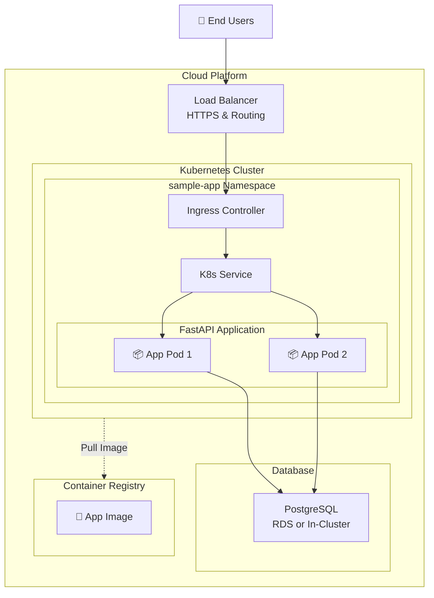

# System Architecture Diagram

This diagram shows the complete system architecture for deploying the application to a public cloud vendor like AWS using modern cloud-native services.

The diagram is written using [Mermaid](https://mermaid.js.org/) which can be [rendered by GitHub](https://docs.github.com/en/get-started/writing-on-github/working-with-advanced-formatting/creating-diagrams):

## AWS Architecture Components

The following architecture components can be used for a production-ready deployment of the application on AWS:

### **Compute & Orchestration**

- **Amazon EKS**: Managed Kubernetes cluster for container orchestration
- **Application Pods**: Multiple replicas on separate Availability Zones for high availability
- **Helm Charts**: Package and deploy the necessary K8s manifest
- **Container Registry**: Host the application image (ECR, GitHub Container Registry, etc.)

### **Networking**

- **VPC**: Isolated network with public/private subnets across multiple AZs
- **Route 53**: DNS management with records pointing to the Application Load Balancer
- **Application Load Balancer**: HTTPS termination with SSL certificate and routing to the application pods
- **Ingress Controller**: NGINX-based ingress for Kubernetes service routing

### **Database**

- **Amazon RDS**: Managed database service for PostgreSQL deployment
  - Database credentials can be stored in AWS Secrets Manager and passed to the application using [external-secrets](https://external-secrets.io/)
- **In-Cluster PostgreSQL**: Cheaper alternative for development/testing environments

### **Monitoring & Observability**

- **Logging**: Application stdout logs can be collected by a monitoring agent and centralized
- **Metrics**: Application metrics exposed on metrics endpoint can be scraped by a monitoring agent
- **Health Checks**: Application and infrastructure health monitoring

### **Deployment Tools**

- **Terraform**: Infrastructure as Code for cloud resources
- **Helm**: Package manager for K8s applications' deployments
- **GitHub Actions**: Automations for CI/CD

## DevOps Flow

1. **Code Changes** → GitHub Actions triggers build
2. **Docker Build** → Image pushed to Container Registry
3. **Terraform** → Provisions cloud infrastructure
4. **Helm Deployment** → Deploys application to Kubernetes cluster
5. **Load Balancer** → Routes traffic to healthy pods
6. **Monitoring** → Monitoring system collects logs and metrics
